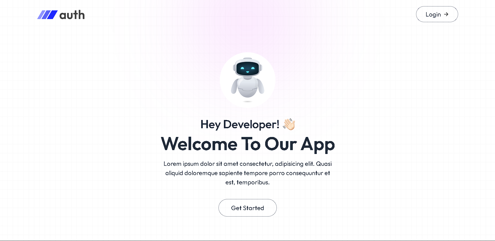
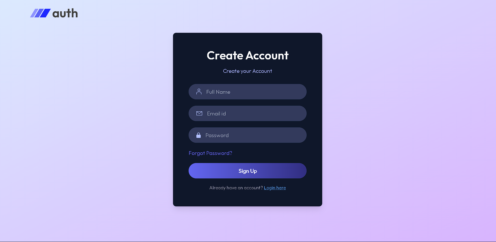

# AUTHENTICATION SYSTEM USING MERN

A full-stack authentication system built with the MERN stack (MongoDB, Express, React, Node.js).  
Features user registration, login, JWT authentication, email verification, password reset, and protected routes.

---

## UI Preview

| Home Page                              | Login Page                              |
|---------------------------------------- |-----------------------------------------|
|  |  |

- **Home image:** `src/assets/Home.png`
- **Login image:** `src/assets/Loginn.png`

---

## Features

- User registration and login with JWT authentication
- Email verification with OTP
- Password reset via email OTP
- Protected routes (backend & frontend)
- Responsive UI with React, Tailwind CSS, and React Toastify
- Secure password hashing (bcryptjs)
- Email sending via Nodemailer (Gmail SMTP)
- MongoDB Atlas integration

---

## Folder Structure
Mern-auth/
  backend/
    config/
    controllers/
    middleware/
    models/
    routes/
    .env
    package.json
    server.js
  frontend/
    public/
    src/
      assets/
      components/
      context/
      pages/
      App.jsx
      main.jsx
      index.css
    .env
    package.json
    tailwind.config.js
    vite.config.js

## Tech Stack
- Frontend: React, Vite, Tailwind CSS, React Router, React Toastify, Axios
- Backend: Node.js, Express, Mongoose, JWT, Bcryptjs, Nodemailer
- Database: MongoDB Atlas

## Environment Variables
 ackend (backend/.env):
- MONGODB_URI - MongoDB connection string
- JWT_SECRET - JWT secret key
- SMTP_USER - Gmail address (App Password required)
- SMTP_PASS - Gmail App Password
- SENDER_EMAIL - Sender email address
- Frontend (frontend/.env):

VITE_BACKEND_URL - Backend API URL

Feel free to fork and customize this project for your own use!
